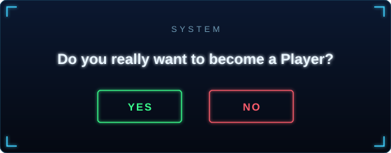
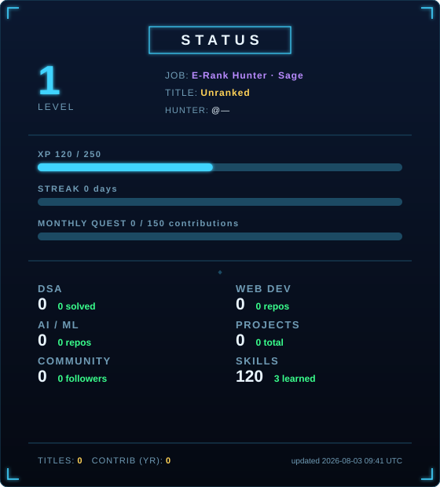
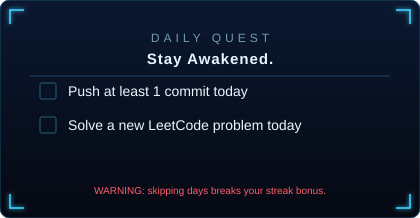
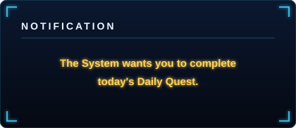

## [SYSTEM]

(Every visitor sees this same prompt — GitHub gives no way to detect who's
logged in on a README, so this is a static greeting rather than a real
per-visitor check. Both buttons scroll to the projects section below.)

# 🗡️ DEVELOPER STATUS WINDOW

<table>
<tr>
<td></td>
<td></td>
</tr>
</table>

*Level, job/class, titles, and quests are all computed automatically from
real GitHub + LeetCode activity. Daily quests refresh every local day, with
a warning if they're still incomplete late in the day, and a penalty quest
if a day is missed entirely.*

---

### ⚔️ EQUIPMENT (Tech Stack)

  
  
  
  
  
  
  
  
  

### 🏰 CLEARED DUNGEONS (Featured Projects)

| Project | Description | Rank |
|---|---|---|
| [Spryzen AI](#) | AI video-generation web app | S-rank |
| [Project Name](#) | One-line description | A-rank |
| [Project Name](#) | One-line description | B-rank |

> This table is the one thing worth hand-editing occasionally — GitHub can't
> reliably auto-detect which projects you're proudest of.

---

`[System]: The grind never stops.`

